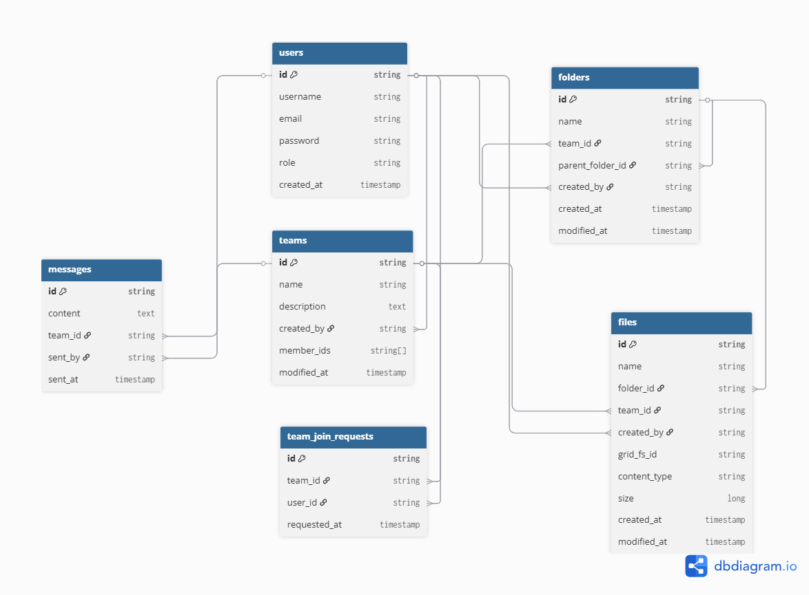

# MRMTeams

## Team
- **Team Name:** MRM-DevTeam
- **Members:**
    - Razvan-Alexandru Anghel - Group Communications (GitHub: [razvananghel83](https://github.com/razvananghel83))
    - Mihai-Sebastian Telu - Document Management (GitHub: [T-ms-code](https://github.com/T-ms-code))
    - Mihai Sima - Enrollment & Access Control (GitHub: [LetMeCode01](https://github.com/LetMeCode01)) 

## Project Description

Lightweight Teams is a SaaS platform aimed at facilitating team collaboration through structured group communication and document management.  
Our goal is to provide an intuitive, fast, and reliable system that avoids common networking issues and simplifies file handling.  

The application focuses on backend APIs to manage messages, documents, and user roles efficiently, ensuring that all interactions are consistent and secure.  
It is designed as a RESTful service with no frontend required, allowing easy integration with clients or other services.

### Key Features
- **Group Communications**
  - Public-first messaging for groups
  - Message truncation with "Show More"  
  - Structural Constraints 
- **Document Management System**
  - Hierarchical folder structure for documents
  - Versioning and integrity checks
  - Naming Conventions 
- **Enrollment & Access Control**
  - Role-based access control
  - Manage who can create/join groups
  - Admin controls for member management and content moderation in groups 

### Technical Stack
- **Backend:** Spring Boot (Java 21)
- **Database:** MongoDB
- **API:** RESTful
- **Testing:** JUnit, Mockito, Cucumber
- **Monitoring:** Prometheus, Grafana
- **Deployment:** Docker

### Database Schema

[](https://dbdiagram.io/d/MRMTeams-69b92ef078c6c4bc7a0226be)

- View the interactive diagram on dbdiagram.io: https://dbdiagram.io/d/MRMTeams-69b92ef078c6c4bc7a0226be

### REST API endpoints

#### Users

| Endpoint | Method | Purpose |
| :--- | :---: | :--- |
| `/api/users` | GET | List all users |
| `/api/users/{id}` | GET | Get one user by ID |
| `/api/users` | POST | Create a new user |
| `/api/users/{id}` | PUT | Update a user's name |
| `/api/users/{id}/name` | PATCH | Partially update a user's name |
| `/api/users/{id}` | DELETE | Delete a user |
| `/api/users/by-email?email={email}` | GET | Get one user by email |
| `/api/users/login` | POST | Authenticate a user and return a token |

#### Teams

| Endpoint | Method | Purpose                                |
| :--- | :---: |:---------------------------------------|
| `/api/teams` | POST | Create a new team                      |
| `/api/teams/{teamId}/members` | POST | Add a member to a team                 |
| `/api/teams/{teamId}` | GET | Get one team by ID                     |
| `/api/teams` | GET | List teams visible to the current user |
| `/api/teams/{teamId}/join-requests` | POST | Submit a join request for a team       |
| `/api/teams/{teamId}/join-requests` | GET | List pending join requests for a team  |
| `/api/teams/{teamId}/join-requests/{userId}/approve` | POST | Approve a user's join request          |
| `/api/teams/{teamId}/members/{userId}` | DELETE | Remove a member from a team            |
| `/api/teams/{teamId}/join-requests/{userId}` | DELETE | Reject a user's join request           |

#### Messages

| Endpoint | Method | Purpose |
| :--- | :---: | :--- |
| `/api/teams/{teamId}/messages` | POST | Create a new message in a team |
| `/api/teams/{teamId}/messages?cursor={messageId_or_iso_timestamp}&limit={1..100}` | GET | List team messages with cursor-based pagination; each item may return truncated `content` with `isTruncated=true` |
| `/api/teams/{teamId}/messages/{messageId}` | GET | Get the full, un-truncated message by ID |
| `/api/teams/{teamId}/messages/{messageId}` | DELETE | Delete a message (admin only) |

#### Folders

| Endpoint | Method | Purpose |
| :--- | :---: | :--- |
| `/api/folders/{teamId}` | GET | List all folders for a team |


## Contributing

All team members follow trunk-based development:
1. Create feature branch from `main`
2. Make changes and commit with clear messages
3. Create PR and request review
4. Address feedback
5. Merge after approval

# Prerequisites

For using Github Codespaces, no prerequisites are mandatory.
Follow the [./PREREQUISITES.md](./PREREQUISITES.md) instructions to configure a local virtual machine with Ubuntu, Docker, IntelliJ.

# Access the code

* Fork the code GitHub repository under your Organization
  * https://github.com/UNIBUC-PROD-ENGINEERING/service
* Clone the code repository:
  * git@github.com:YOUR_ORG_NAME/service.git

# Run code in Github Codespaces

* Make sure that the Github repository is forked under your account / Organization
* Create a new Codespace from your forked repository
* Wait for the Codespace to be up and running
* Make sure that Docker service has been started
    * ```docker ps``` should return no error
* For running / debugging directly in Visual Studio Code
  * Start the MongoDB related services
    * ```./start_mongo_only.sh```
  * Build and run the Spring Boot service
    * ```./gradlew build```
    * ```./gradlew bootRun```
* For running all services in Docker:
    * Build the Docker image of the prod-eng service
        * ```make build```
    * Start all the service containers
        * ```./start.sh```
* Use [requests.http](requests.http) to test API endpoints
* Navigation between methods (e.g. 'Go to Definition') may require:
  * ```./gradlew build``` 

NOTE: for a live demo, please check out [this youtube video](https://youtu.be/-9ePlxz03kg)

# Run/debug code in IntelliJ
* Build the code*
    * IntelliJ will build it automatically
    * If you want to build it from command line and also run unit tests, run: ```./gradlew build```
* Create an IntelliJ run configuration for a Jar application
    * Add in the configuration the JAR path to the build folder `./build/libs/prod-eng-0.0.1-SNAPSHOT.jar`
* Start the MongoDB container using Docker Compose
    * ```./start_mongo_only.sh```
* Run/debug your IntelliJ run configuration
* Open in your browser:
    * http://localhost:8080/api/users
* If you open a Dev Container to run the application instead of using the local Docker and JDK from WSL, you need to modify 
docker-compose.yml and .devcontainer/devcontainer.json according to the instructions provided in docker-compose.yml under mongo-admin-ui
  ( line 40 ). The devcontainer.json file should be modified at line 36 to add the port 8090. 
From this "forwardPorts": [8080] to this "forwardPorts": [8080, 8090]. This will allow you to view the Mongo Admin UI inside your 
Windows browser.

# Deploy and run the code locally as Docker instance

* Build the Docker image of the prod-eng service
    * ```make build```
* Start all the containers
    * ```./start.sh```

* Verify that all containers started, by running
  ```
  service git:(master) ✗  $ docker ps
  CONTAINER ID   IMAGE             COMMAND                  CREATED         STATUS         PORTS                                                                                          NAMES
  d0a14d57ade1   jenkins/jenkins   "/usr/bin/tini -- /u…"   5 seconds ago   Up 4 seconds   0.0.0.0:50000->50000/tcp, [::]:50000->50000/tcp, 0.0.0.0:8082->8080/tcp, [::]:8082->8080/tcp   service-jenkins-1
  d9465565ebc9   mongo-express     "/sbin/tini -- /dock…"   5 seconds ago   Up 4 seconds   0.0.0.0:8090->8081/tcp, [::]:8090->8081/tcp                                                    service-mongo-admin-ui-1
  304c29bb39ea   mongo:6.0.20      "docker-entrypoint.s…"   5 seconds ago   Up 4 seconds   0.0.0.0:27017->27017/tcp, [::]:27017->27017/tcp                                                service-mongo-1
  a74b4cb2fb58   prod-eng-img      "java -jar /prod-eng…"   5 seconds ago   Up 4 seconds   0.0.0.0:5005->5005/tcp, [::]:5005->5005/tcp, 0.0.0.0:8080->8080/tcp, [::]:8080->8080/tcp       service-prod-eng-1
  ```
* Open in your browser:
    * http://localhost:8080/api/users
* You can test other API endpoints using [requests.http](requests.http)
* You can access the MongoDB Admin UI at:
  * http://localhost:8090
  * default credentials: username `unibuc`, password `adobe`
  * database `test` contains application entities
